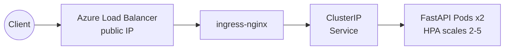
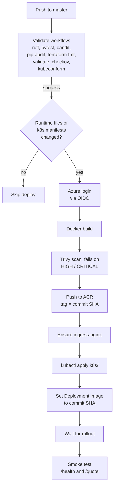
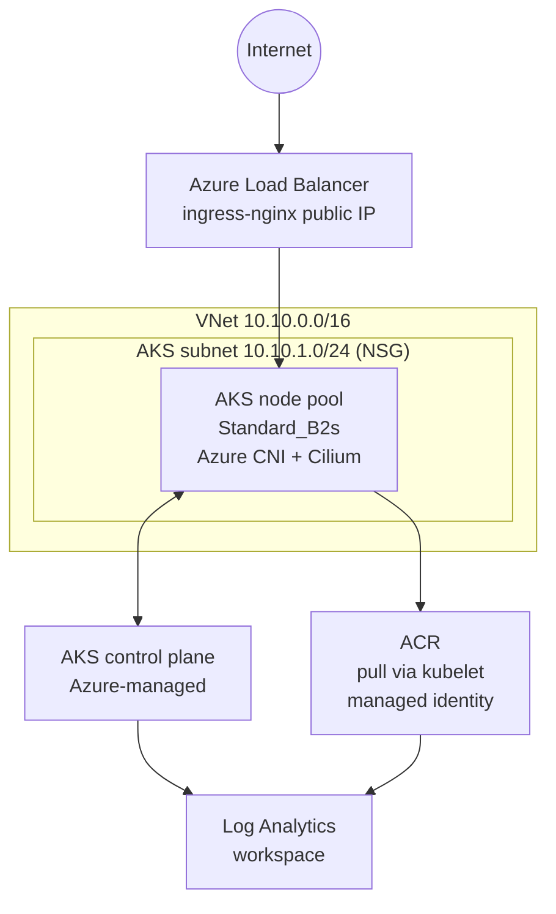

# FastAPI on Azure with Terraform, AKS, and GitHub Actions

[](https://github.com/alexvidi/Azure-Cloud-Infrastructure-Kubernetes-Docker-Terraform-GitHubActions/actions/workflows/validate.yml)
[](https://www.terraform.io/)
[](https://azure.microsoft.com/)
[](https://kubernetes.io/)

**A production-style delivery platform for a small FastAPI service: Terraform-provisioned Azure infrastructure, keyless OIDC CI/CD, hardened Kubernetes on AKS, and Prometheus/Alertmanager/Grafana observability — deployed end-to-end and fully documented below.**

The application is intentionally simple; the focus of this repository is the platform around it. Features that were not justified by the current workload were deliberately left out so the repository reflects the technologies that are actually being used.

> **Project status:** the Azure environment is provisioned and destroyed per validated run to control cost. The complete end-to-end run is documented in [Proof of Run](#proof-of-run) and the [Full Run Gallery](#full-run-gallery).

> **Multi-cloud sibling:** the same platform implemented on AWS — EKS, ECR, IAM OIDC, and EKS Access Entries — lives in [AWS-Cloud-Infrastructure-Kubernetes-Docker-Terraform-GitHubActions](https://github.com/alexvidi/AWS-Cloud-Infrastructure-Kubernetes-Docker-Terraform-GitHubActions).


## At a Glance

| Area | Implementation |
| --- | --- |
| Cloud | Azure Resource Group, VNet, ACR, AKS, Log Analytics |
| IaC | Modular Terraform (`network`, `registry`, `aks`, `monitoring`) with remote state in Azure Blob Storage |
| Containerization | Dockerized FastAPI app running as non-root |
| Kubernetes | Namespace, Deployment, Service, Ingress, HPA, NetworkPolicy, PDB, raw monitoring manifests |
| Packaging | Raw Kubernetes manifests |
| CI/CD | GitHub Actions validate and deploy workflows, authenticated to Azure via OIDC |
| Security | Pod Security Admission, container hardening, Cilium NetworkPolicy enforcement, managed identities, Azure RBAC, Trivy, Checkov |
| Observability | Prometheus + Alertmanager + Grafana in-cluster, plus Log Analytics for AKS control plane and ACR logs |

## Proof of Run

<table>
  <tr>
    <td width="50%">
      <br/>
      <sub><b>CI/CD:</b> build → Trivy scan → ACR push → AKS rollout → smoke test, all green.</sub>
    </td>
    <td width="50%">
      <br/>
      <sub><b>AKS:</b> the managed cluster provisioned by Terraform and linked to the container registry.</sub>
    </td>
  </tr>
  <tr>
    <td width="50%">
      <br/>
      <sub><b>Observability:</b> live request rate, latency, and status-code metrics in Grafana.</sub>
    </td>
    <td width="50%">
      <br/>
      <sub><b>Application:</b> <code>/quote</code> served through the Kubernetes ingress public IP.</sub>
    </td>
  </tr>
</table>

## Architecture

### Runtime Request Flow



### Delivery Flow



### Network Topology



The control plane ships `kube-apiserver`, `kube-audit`, `kube-scheduler`, `kube-controller-manager`, `cluster-autoscaler`, and `guard` logs to Log Analytics via diagnostic settings; ACR ships login and repository events to the same workspace.

## Key Technical Decisions

- **Simple application, real platform concerns**
  The API is intentionally lightweight so the repository can focus on infrastructure, deployment, security, and operations.

- **Terraform modules instead of a flat root configuration**
  Azure infrastructure is split into `network`, `registry`, `aks`, and `monitoring` modules to keep concerns separated and reusable. The composition — including the two role assignments — happens in the root module.

- **AKS with Azure CNI powered by Cilium**
  The cluster uses Azure CNI with Cilium as both the network policy engine and the dataplane, aligned with the current AKS networking direction. This is what makes the application `NetworkPolicy` actually enforced.

- **ingress-nginx instead of Application Gateway (for now)**
  The application is exposed through the `ingress-nginx` controller, which gets a public IP from a standard Azure Load Balancer. This keeps the ingress layer simple and cloud-agnostic; moving to Application Gateway for Containers is a natural next iteration.

- **Image pulls via managed identity, no registry passwords**
  The ACR admin user is disabled. The AKS kubelet identity holds an `AcrPull` role assignment, so nodes pull images with Azure-managed credentials only.

- **Keyless CI/CD with OIDC and Azure RBAC**
  GitHub Actions logs in to Azure through OIDC federation (no client secrets stored). The Service Principal is granted `Azure Kubernetes Service RBAC Cluster Admin` through Azure RBAC instead of the `--admin` certificate bypass, so cluster access stays auditable and revocable.

- **HPA without extra add-ons**
  Unlike EKS, AKS bundles `metrics-server`, so the HPA reads pod CPU out of the box — no installation step in the pipeline.

- **Baseline runtime hardening**
  The Deployment runs as non-root, disables privilege escalation, drops Linux capabilities, and uses Pod Security Admission in `restricted` mode. The cluster additionally enables Azure Policy, automatic patch upgrades, and host encryption on the node pool.

- **Restrictive network posture**
  The application `NetworkPolicy` allows ingress only from the `ingress-nginx` and `monitoring` namespaces on the application port, and denies all egress because the current API does not require outbound network access.

- **Availability controls**
  The project includes an HPA for CPU-based scaling and a PDB to avoid all replicas being voluntarily disrupted at once.

- **No unnecessary platform features**
  GitOps controllers, certificate automation, databases, and tracing were intentionally left out to keep the repository focused and technically consistent.

## Repository Structure

```text
app/                FastAPI application and Dockerfile
infra/              Terraform root and modules (network, registry, aks, monitoring)
k8s/                Raw Kubernetes manifests
.github/workflows/  Validation and deployment pipelines
docs/               Architecture diagram and project screenshots
```

## Main Components

### Application

The API is implemented in [app/main.py](app/main.py).

Endpoints:

- `GET /health` — used by Kubernetes probes and operational checks.
- `GET /quote?symbol=BTC` — returns a synthetic market quote for a supported symbol.
- `GET /metrics` — exposed for Prometheus scraping.

The business logic is intentionally lightweight and explicit. The API returns synthetic quotes for a small supported symbol set so the repository can emphasize cloud delivery and runtime operations.

### Infrastructure

Terraform lives under [infra/](infra).

Main modules:

- `network` — a VNet with a dedicated AKS subnet and an associated Network Security Group.
- `registry` — an Azure Container Registry with the admin user disabled (managed identities only).
- `aks` — an AKS cluster with Azure CNI powered by Cilium, Azure AD RBAC, authorized IP ranges for the API server, Azure Policy, automatic patch upgrades, and host encryption.
- `monitoring` — a Log Analytics workspace plus diagnostic settings for the AKS control plane and ACR events.

The composition happens in [infra/main.tf](infra/main.tf). Two role assignments are managed there: `AcrPull` on ACR for the AKS kubelet identity, and `Azure Kubernetes Service RBAC Cluster Admin` on AKS for the GitHub Actions Service Principal.

### Kubernetes

Raw manifests live in [k8s/](k8s): namespace, deployment, service, ingress, hpa, networkpolicy, pdb, and the monitoring stack (Prometheus, Alertmanager, Grafana). The Deployment image points to the project's ACR repository; the deploy workflow overrides it with the validated commit SHA.

### CI/CD

#### Validation Workflow

[.github/workflows/validate.yml](.github/workflows/validate.yml) runs `ruff`, `pytest`, `bandit`, `pip-audit`, `terraform fmt`, `terraform validate`, `checkov`, and `kubeconform`.

#### Deploy Workflow

[.github/workflows/deploy.yml](.github/workflows/deploy.yml) runs after a successful Validate on `master` and only when the validated commit changes application runtime files or Kubernetes manifests. It logs in to Azure via OIDC, builds the image, scans it with Trivy (failing on HIGH/CRITICAL), pushes it to ACR, ensures `ingress-nginx` exists, creates the Grafana and Alertmanager Secrets from GitHub secrets, applies the manifests to AKS, sets the Deployment image to the validated commit SHA, waits for the rollout, and runs a post-deploy smoke test against `/health` and `/quote`.

Required GitHub Secrets:

- `AZURE_CLIENT_ID`, `AZURE_TENANT_ID`, `AZURE_SUBSCRIPTION_ID` — OIDC federation for the deploy Service Principal
- `ACR_NAME` — the registry name
- `AKS_RESOURCE_GROUP`, `AKS_NAME` — cluster coordinates for `az aks get-credentials`
- `GRAFANA_ADMIN_USER`, `GRAFANA_ADMIN_PASSWORD`
- `ALERTMANAGER_SMTP_PASSWORD`

### Observability

The application exposes Prometheus metrics at `/metrics`. The in-cluster monitoring stack (Prometheus, Alertmanager, Grafana) is deployed with raw manifests into the `monitoring` namespace. Grafana is provisioned from ConfigMaps (datasource + dashboard), and Prometheus evaluates two baseline alerting rules (`MarketQuoteApiDown`, `MarketQuoteApiHighServerErrorRate`). Grafana admin credentials and the Alertmanager SMTP password are created as Kubernetes Secrets outside the repo.

At the platform level, diagnostic settings ship AKS control plane logs and ACR registry events to a Log Analytics workspace with 30-day retention.

## Security Posture

- non-root container runtime, pod and container `securityContext`
- Pod Security Admission in `restricted` mode for the application namespace
- `allowPrivilegeEscalation: false` and dropped Linux capabilities
- resource requests and limits
- `NetworkPolicy` with denied egress by default, enforced by Cilium
- ACR admin user disabled; image pulls via the kubelet managed identity with `AcrPull`
- GitHub Actions authenticated via OIDC; cluster access through Azure RBAC instead of the `--admin` bypass
- AKS API server restricted by authorized IP ranges (configurable), Azure AD RBAC enabled
- Azure Policy add-on, automatic patch upgrades, and host encryption on the node pool
- Grafana and Alertmanager credentials externalized into Kubernetes Secrets
- Trivy image scanning and Checkov IaC scanning in CI

## How to Run

### 1. Prepare the Terraform Remote State (one time)

The backend in [infra/backend.tf](infra/backend.tf) stores state in Azure Blob Storage. Create the backend resources once:

```bash
az group create \
  --name alexdevops99-tfstate-rg \
  --location eastus

az storage account create \
  --name alexdevops99tfstate01 \
  --resource-group alexdevops99-tfstate-rg \
  --location eastus \
  --sku Standard_LRS \
  --kind StorageV2

az storage container create \
  --name tfstate \
  --account-name alexdevops99tfstate01 \
  --auth-mode login
```

### 2. Provision Azure Infrastructure

The `github_sp_object_id` variable is required: it is the Object ID of the Service Principal used by GitHub Actions, and it receives AKS cluster-admin via Azure RBAC. Obtain it with:

```bash
az ad sp show --id <AZURE_CLIENT_ID> --query id -o tsv
```

Add it to `infra/terraform.tfvars` (gitignored):

```hcl
github_sp_object_id = "<object-id>"
```

Then provision:

```bash
cd infra
terraform init
terraform plan
terraform apply
cd ..
```

Note the outputs: `resource_group_name`, `acr_login_server`, `aks_cluster_name`.

### 3. Build and Push the Image

```bash
az acr login --name alexdevops99acr

docker build -t alexdevops99acr.azurecr.io/market-quote-api:v1 app
docker push alexdevops99acr.azurecr.io/market-quote-api:v1
```

### 4. Connect kubectl to AKS

```bash
az aks get-credentials \
  --resource-group alexdevops99-rg \
  --name alexdevops99-aks \
  --overwrite-existing
```

### 5. Deploy to Kubernetes

```bash
kubectl apply -f https://raw.githubusercontent.com/kubernetes/ingress-nginx/controller-v1.15.1/deploy/static/provider/cloud/deploy.yaml
kubectl rollout status -n ingress-nginx deployment/ingress-nginx-controller --timeout=180s
kubectl apply -f k8s/namespace.yaml
kubectl apply -f k8s/monitoring-namespace.yaml
kubectl create secret generic grafana-admin \
  -n monitoring \
  --from-literal=admin-user=admin \
  --from-literal=admin-password='<strong-password>' \
  --dry-run=client -o yaml | kubectl apply -f -
kubectl create secret generic alertmanager-smtp \
  -n monitoring \
  --from-literal=smtp-password='<smtp-app-password>' \
  --dry-run=client -o yaml | kubectl apply -f -
kubectl apply -f k8s/
kubectl rollout restart -n monitoring deployment/prometheus-server deployment/alertmanager
```

For direct `kubectl apply`, the image tag referenced in [k8s/deployment.yaml](k8s/deployment.yaml) must exist in ACR, or rely on the deploy workflow which sets it to the validated commit SHA. The Alertmanager email receiver is configured for Gmail SMTP in [k8s/alertmanager-config.yaml](k8s/alertmanager-config.yaml); use an app password, not a personal account password.

### 6. Access the Application

After the ingress controller is assigned a public IP, the API is reachable through it (the Ingress omits a host name to keep the demo simple). In a production-style setup, a DNS record would point a domain at the public IP and TLS would be configured on the Ingress.

### 7. Access Observability

```bash
kubectl port-forward -n monitoring svc/prometheus-server 9090:9090
kubectl port-forward -n monitoring svc/alertmanager 9093:9093
kubectl port-forward -n monitoring svc/grafana 3000:3000
```

Then open `http://127.0.0.1:9090` (Prometheus), `http://127.0.0.1:9093` (Alertmanager), and `http://127.0.0.1:3000` (Grafana). To simulate the `MarketQuoteApiDown` alert:

```bash
kubectl scale deployment market-quote-api -n market-quote --replicas=0
# restore after the alert fires
kubectl scale deployment market-quote-api -n market-quote --replicas=2
```

### 8. Tear Down

The node VM, public IP, and Log Analytics ingestion bill while the environment is up. Destroy everything when you are done:

```bash
cd infra
terraform destroy
```

Deleting the AKS cluster also removes its managed node resource group (`MC_*`), which contains the ingress load balancer and public IP.

## Limitations & Next Steps

Deliberate scope cuts for a coherent demo, and what the next iteration would add:

- **TLS and DNS** — the Ingress omits host and TLS so the demo works directly through the public IP. Next: a real domain, `cert-manager` with Let's Encrypt, and host-based routing.
- **Application Gateway** — `ingress-nginx` keeps the ingress layer simple and portable. Next: Application Gateway for Containers with WAF policies.
- **Single-node pool** — one `Standard_B2s` node is a cost optimization for a demo; production would run a zone-spread node pool with the cluster autoscaler enabled.
- **Push-based deploys** — CI applies manifests with `kubectl`. Next: pull-based GitOps reconciliation with Argo CD or Flux.
- **Monitoring durability** — in-cluster Prometheus stores data in an `emptyDir`. Next: persistent storage, `kube-state-metrics`, or Azure Monitor managed service for Prometheus.
- **Raw manifests** — transparent for review, but Helm or Kustomize overlays would be the natural step for multi-environment deploys.

## Full Run Gallery

Every screenshot below documents a single end-to-end Azure run of the project before the cloud resources were deprovisioned to control cost.

<details>
<summary><b>Infrastructure — resource group, AKS, ACR, networking</b></summary>


The resource group with the core Azure resources created by Terraform: AKS, ACR, VNet, NSG, and Log Analytics.


The AKS overview confirms the managed cluster was provisioned successfully and linked to the container registry used by the deployment pipeline.


The `AcrPull` role assignment that lets the AKS kubelet identity pull images from ACR without registry passwords.


The public IP assigned to the `ingress-nginx` load balancer — the public entry point to the application.


The Terraform remote state stored in an Azure Blob Storage container.

</details>

<details>
<summary><b>CI/CD — Validate and Deploy workflows</b></summary>


The Validate and Deploy workflows in GitHub Actions.


Validation passing application checks, Terraform validation, Checkov IaC security, and Kubernetes manifest schema validation.


The deploy workflow summary: change detection, build and scan, and the manifest rollout to AKS.


A deploy run completing image build, ACR push, manifest rollout, and the post-deploy smoke test.

</details>

<details>
<summary><b>Application — served through the ingress</b></summary>


The Swagger UI reachable through the Kubernetes ingress from a browser.


The OpenAPI documentation generated by FastAPI for the deployed service.


The `/health` endpoint used by Kubernetes probes and the post-deploy smoke test.


The `/quote` endpoint returning a synthetic market quote for a supported symbol.


An unsupported symbol returns a controlled `400` with the list of supported symbols.

</details>

<details>
<summary><b>Kubernetes — application and monitoring resources</b></summary>


Application resources in the `market-quote` namespace: pods, Service, Deployment, and the HPA.


The application Service and Ingress routing external traffic into the namespace.


The application Ingress and PodDisruptionBudget.


Prometheus, Grafana, and Alertmanager resources in the `monitoring` namespace.


Monitoring workloads and Services running in the `monitoring` namespace.

</details>

<details>
<summary><b>Observability — Prometheus, Grafana, Log Analytics</b></summary>


Prometheus scrapes the application metrics endpoint successfully (target `UP`).


The provisioned Market Quote API dashboard in Grafana.


Live request rate, latency, and status-code metrics collected from the running application.


The Log Analytics workspace receiving AKS control plane logs through diagnostic settings.


Querying cluster logs in the Log Analytics workspace.


The AKS Insights summary for the cluster in Azure Monitor.


ACR image push and pull events shipped to Log Analytics.

</details>

## Author

**Alexandre Vidal**
Email: alexvidaldepalol@gmail.com
[LinkedIn](https://www.linkedin.com/in/alexvidi/)
[GitHub](https://github.com/alexvidi)
